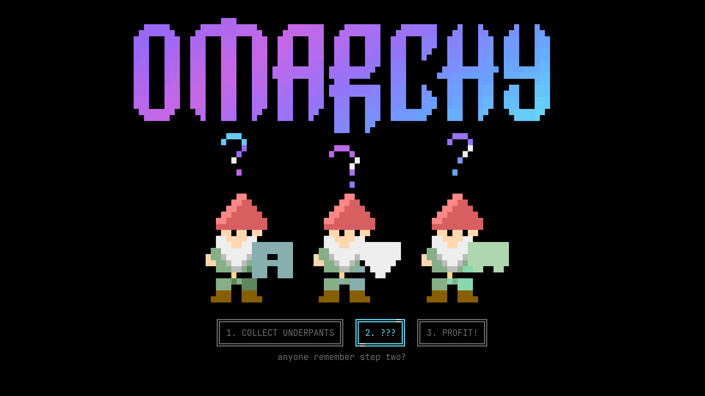
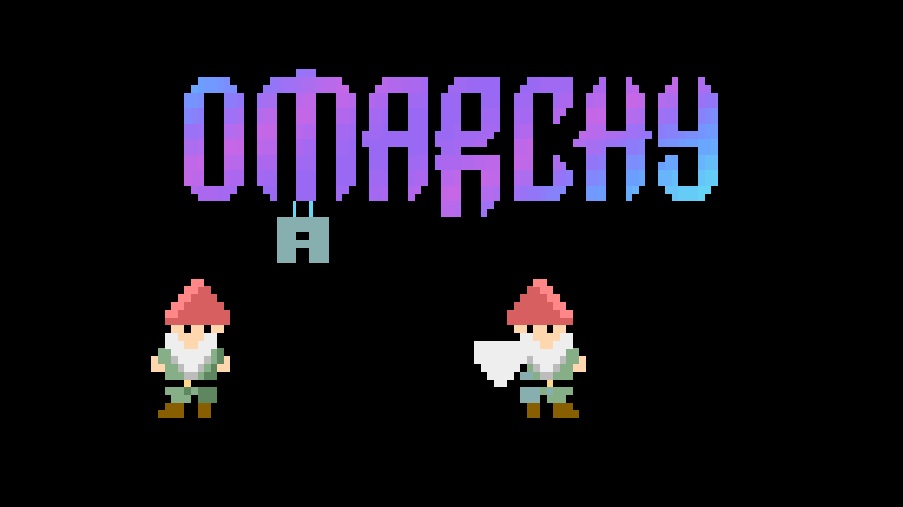

# Underpants Gnomes — Story & Zen

Two screensavers in one standard Omarchy plugin, `douper.underpants`:

- **Story** — a 53-second three-phase heist with boxed, illuminated phase labels, animated block question marks, and an optimistic gold-coin payoff.
- **Zen** — a continuously animated electric Omarchy logo that grows fresh underwear for gnomes to steal. Three staggered 15-second laundry cycles, crossing light sweeps, colour waves and a gentle logo ripple. No captions, phase labels, creed, coins, or story reset.

Both modes share the same renderer and launch lifecycle; no duplicate plugin installations are needed. The default remains Story for existing launchers.





## Story

A silent block-text terminal screensaver for Omarchy, inspired by [DHH's underpants-gnome post](https://x.com/dhh/status/2097915338956427515). Underpants hang directly from the stock Omarchy wordmark. Solid, red-hatted gnomes sneak in, jump to steal them, and carry them away. The thefts take 21 seconds, followed by a five-second huddle: “anyone remember step two?”

The wordmark's alternating rows slide in from opposite sides and lock into place, then a bright horizontal scanline sweeps down the lettering. The opening owns the theft: “boxers. briefs. knickers. consider this a heist.” The copy takes its earnest, optimistic tone from [DHH's September 10 creed](https://x.com/dhh/status/2097919711170203998). The heist is the joke; better computers for everyone, including the gnomes, is the payoff.

At 26 seconds, the logo crumbles and large block letters assemble into **BETTER COMPUTERS / FOR EVERYONE**. Gold coins start spraying as the first headline begins assembling, leaving clear space for the lettering. Then **including the gnomes.** types in gold. After celebrating, the gnomes leave room for **BE EARNEST. BE SINCERE. BE BRAVE.** to assemble in the same large font beneath the headline. The message holds with a travelling highlight before dissolving into the next loop.

Black background, electric violet, magenta, blue and cyan lettering, and coloured sprites made from `█`, `▀`, and `▄`. The logo and payoff lettering use a 32-step true-colour gradient, with gold reserved for the coins and punchline. Each terminal cell holds two vertical sprite pixels using foreground/background colours. A 53-second loop at 12 fps, drawing only changed terminal rows with synchronized output. No images, videos, network calls, sound, or additional Python packages. The animation uses its own terminal renderer; it does not run inside TTE/ttfx.

This is a standard Omarchy shell plugin (`douper.underpants`, kind `overlay`). It uses the default terminal's stock screensaver configuration and the `org.omarchy.screensaver` window class for Omarchy's idle tracking. Supports Foot, Alacritty, Ghostty, and Kitty. Any key, mouse movement, a closed window, or loss of screensaver focus dismisses the session across all monitors. Only terminals created by this plugin are stopped. Both modes use the same session lock, so they cannot stack screensaver windows.

## Install locally

```bash
bash install.sh
```

Requires Omarchy Quattro with its shell plugin API (tested with 4.0.3-1), Python 3.11 or later, Hyprland/`hyprctl`, `xdg-terminal-exec`, and one of the supported terminals. No root access, network access at runtime, background service, native build, or extra Python dependencies are needed. Foot is live-tested; Alacritty, Ghostty and Kitty launch arguments are tested but their live rendering remains unverified.

The installer validates and copies the plugin. Add `--enable` to explicitly rescan and enable it. Replacing an existing local copy requires `--force` and creates a backup first; Git-managed and symlinked copies are not overwritten. Omarchy discovers plugins under `~/.config/omarchy/plugins/`, so the installer intentionally follows that path even if `XDG_CONFIG_HOME` differs. Installing into a watched plugin directory may reload shell code; choose a convenient time. This preparation checkout is separate from the installed copy.

```bash
bash install.sh --enable          # new local installation and explicit activation
bash install.sh --force --enable  # back up and replace an existing local copy
```

Neither installation nor activation edits your menu or idle/lock settings. The plugin is a screensaver, not a security lock. Like all Omarchy plugins it runs unsandboxed with your user permissions; review the source before enabling it. Its only runtime writes are session lock/stop files in your runtime directory. It starts its own terminal processes and requests monitor focus while mapping them; dismissal stops only those processes.

After replacing QML in an already loaded copy, restart the shell at a convenient time with `omarchy restart shell`: current Quickshell versions may cache the old component at the same path despite a plugin rescan. The installer does not restart your desktop automatically.

Launch either screensaver through the shell:

```bash
omarchy-shell shell summon douper.underpants '{"mode":"story"}'
omarchy-shell shell summon douper.underpants '{"mode":"zen"}'
```

For two separate menu entries, merge the entries from `menu-entries.json` into your existing `~/.config/omarchy/extensions/omarchy-menu.jsonc` object. Do not replace the file: it may contain other custom entries. The actions are:

```jsonc
{
"system.underpants": {"label":"Underpants Gnomes — Story","action":"omarchy-shell shell summon douper.underpants '{\"mode\":\"story\"}'"},
"system.underpants-zen": {"label":"Underpants Gnomes — Zen","action":"omarchy-shell shell summon douper.underpants '{\"mode\":\"zen\"}'"}
}
```

Enabling the plugin makes it available on demand. It does not replace the default idle screensaver or change lock timings. Omarchy currently has no dedicated screensaver plugin kind or selectable idle screensaver API.

## Preview and checks

```bash
python3 screensaver.py                 # animate in the current terminal
python3 screensaver.py --frame 9        # print one plain-text frame
python3 screensaver.py --launch         # fullscreen on all monitors
python3 screensaver.py --launch --preview # keyboard-only dismissal for watching
python3 screensaver.py --launch --preview --mode zen
python3 -m unittest discover -s tests
```

For private GUI testing, sync the project with `agent-desktop sync` before launching its remote path with `agent-desktop run`. The optional `--duration 60` exits automatically; `--offset 26` jumps to the payoff reveal.

## Distribution

Version 2.0.0 is an **unpublished release candidate** bundling both modes under the same MIT-licensed manifest. The directory is ready to be the root of an Omarchy plugin repository; after publishing it, users can install its Git URL with `omarchy plugin add https://github.com/rdoupe-omarchy/omarchy-underpants --enable`. Standard Git installation needs no custom install hook. No public repository is assumed or created by the local installer.

To build a local release archive from this directory:

```bash
python3 scripts/package.py
```

Unpack into a new directory and run `bash install.sh`. To remove the plugin, run `omarchy plugin remove douper.underpants` and remove only its two optional menu entries.

See [TESTING.md](TESTING.md) for verification, [PUBLISHING.md](PUBLISHING.md) for the approval checklist, and [CHANGELOG.md](CHANGELOG.md) for the candidate release notes. The stock Omarchy wordmark is credited to David Heinemeier Hansson in [LICENSE](LICENSE); sprites and renderer additions are by douper. This is an independent community joke, not an official Omarchy product or endorsement.
